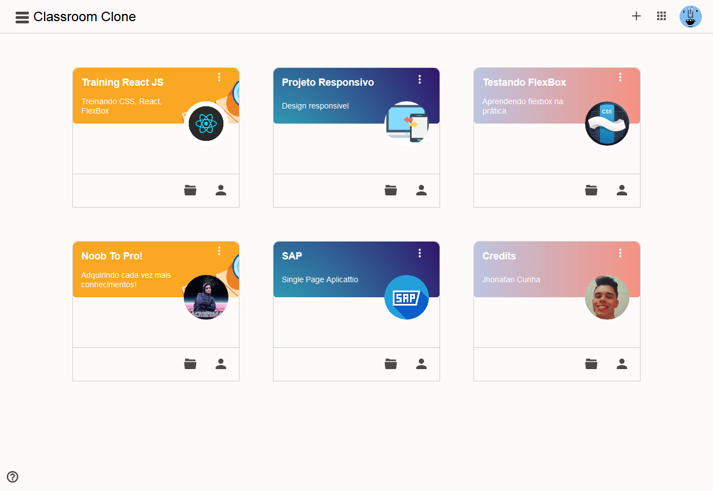
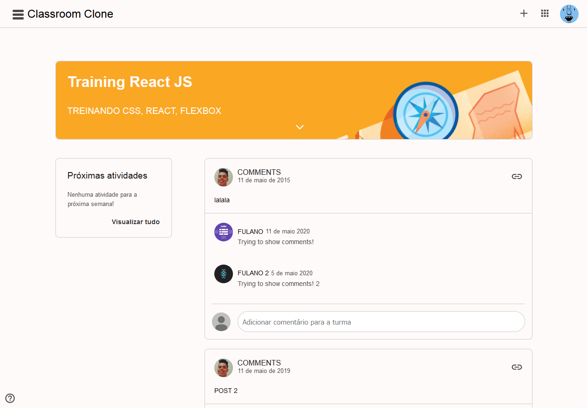

<h1 align="center">Classroom System - ReactJS [W.I.P]<h1>
<p align="center">


</p>

<br>
<a id="sobre"></a

## :bookmark: Sobre


<p align="center">
    Tentativa de recriação da interface do Google Classsroom com objetivo de adquirir mais experiencia em React & CSS & FlexBox
</p>

<br>

# :computer: Web View

### :busts_in_silhouette: Profile Page
<p align="center">
    
</p>

### :cool: SideBar Menu
<p align="center">
    
</p>

### :pencil: Tasks Page
<p align="center">
    
</p>


# :iphone: Mobile View

<h2 align="center">Profile Page - SideBar Menu - Task Page</h2>

<p align="center">
    
</p>


## 🚀 Tecnologias

- [ReactJS]
- [Styled-Components]

## ❓ Como utilizar?

### Instalação

```bash
$ cd classroom-clone
$ yarn
$ yarn start
```

<br>


<p align="center">
Criado com :coffee: por :copyright: Jhonatan Cunha.
</p>
